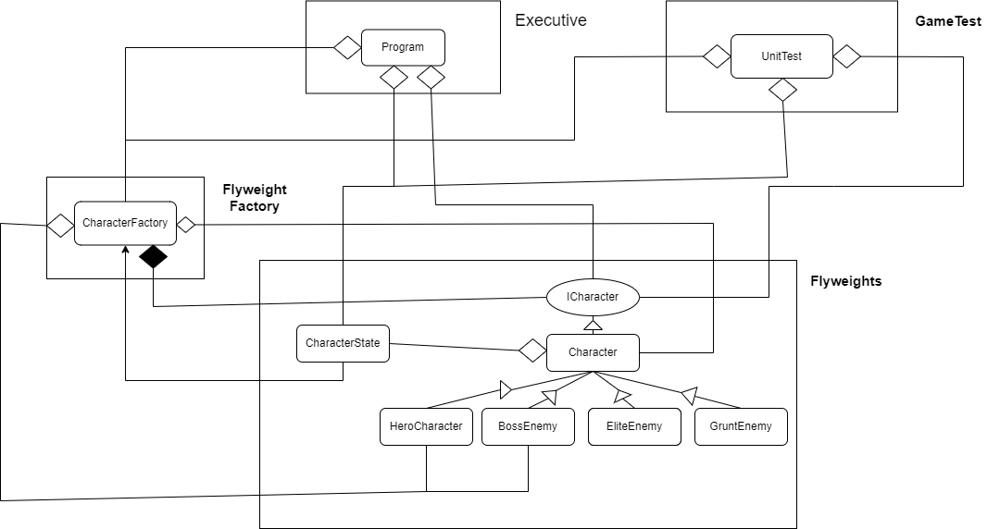

# Flyweight Design Pattern Project

## Overview

The Flyweight design pattern is a structural pattern that focuses on minimizing memory usage by sharing as much data as possible with similar objects. This pattern is particularly useful when dealing with a large number of objects that have many shared states but also have unique, mutable states. The primary goal is to reduce the overhead of creating numerous objects with similar attributes.

### What is the Flyweight Design Pattern?

The Flyweight pattern allows objects to share common state and only maintain their unique state independently. This pattern is best suited for scenarios where objects are numerous and the cost of instantiating a large number of objects is high. The Flyweight pattern is designed to work with immutable shared states and mutable unique states.

In essence, the Flyweight pattern involves:
1. **Flyweight Interface**: Defines the methods for interacting with the flyweight objects.
2. **Concrete Flyweight**: Implements the Flyweight interface and represents the shared state.
3. **Unshared Concrete Flyweight**: Manages the unique, mutable state.
4. **Flyweight Factory**: Creates and manages flyweight objects, ensuring that shared states are reused properly.

## Project Description

This project demonstrates the Flyweight design pattern through a simple game simulation involving various character types. The game includes heroes and enemies with different attributes, showcasing how the Flyweight pattern can be used to manage shared and unique states efficiently.

### Key Components

- **Character**: Abstract class representing a generic game character. Implements the Flyweight interface.
- **HeroCharacter**: Concrete Flyweight class for hero characters.
- **BossEnemy**: Concrete Flyweight class for boss enemies.
- **EliteEnemy**: Concrete Flyweight class for elite enemies.
- **GruntEnemy**: Concrete Flyweight class for grunt enemies.
- **CharacterState**: Manages the state of characters, holding mutable data like status numbers.
- **CharacterFactory**: Factory class responsible for creating and managing character objects, ensuring that shared states are reused.

### How It Demonstrates the Flyweight Pattern

In this project:
1. **Shared State**: Characters like `Hero`, `BossEnemy`, `EliteEnemy`, and `GruntEnemy` share common attributes such as type and name, which are managed by the `CharacterFactory`. This reduces the memory footprint by reusing instances with the same shared state.
2. **Unique State**: Each `CharacterState` instance holds unique state information, such as the character’s status number. This data is specific to each character instance and is not shared.

The `CharacterFactory` class ensures that only one instance of each character type is created and reused throughout the game simulation. This approach not only reduces the memory usage but also maintains consistency across the game.

## Design

The project is structured to clearly illustrate the Flyweight pattern:
- **Classes**: Each character type (e.g., `HeroCharacter`, `BossEnemy`) is a concrete implementation of the shared state, while `CharacterState` handles the mutable state.
- **Factory**: `CharacterFactory` is responsible for creating and managing flyweight objects and ensures that the shared state is reused efficiently.

## Usage

To see the Flyweight design pattern in action:
1. Create characters using the `CharacterFactory`.
2. Use different character types to simulate attacks and observe how shared and unique states interact.
3. Run the unit tests to verify the behavior and correctness of the Flyweight pattern implementation.

## Real World Applications

The Flyweight pattern can be applied in various scenarios, including:
- **Gaming**: Managing a large number of game entities where many share common attributes.
- **Graphics Rendering**: Reusing graphical objects to minimize memory usage.
- **Text Processing**: Handling a large number of text objects with shared formatting.

## Environment

The project builds and runs with Visual Studio Community 2022. Ensure that the required workloads and dependencies are installed to successfully compile and execute the project.